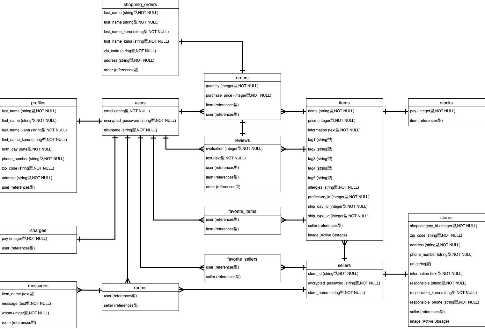

# アプリ名
FOOD MALL

 

# 概要
販売者が飲食物を販売しユーザーが購入する事のできる、モール型ECショップのアプリケーション

 

# 本番環境(未デプロイ)
- URL  
   https://food-mall-ecshop.herokuapp.com/

- テスト用アカウント(購入ユーザー)  
   email :  user123  
   password :  user123

- テスト用アカウント(販売者)  
   店舗ID :  test123  
   password :  test123

- テスト用クレジットカード  
   カード番号 : 4242424242424242  
   有効期限 :  10/24  
   セキュリティーコード :  123  
   

# 制作背景
   コロナ禍による在宅ワークの増加や時短営業が原因で外食を行うことが厳しくなった。普段から本格的なレストランの料理を楽しんでいる食通の方と、客足や売り上げが下がったレストランとをつなぐアプリケーションを製作した。

 

# 機能一覧
- ユーザー管理機能
- 販売者管理機能
- 販売者詳細表示機能
- 販売者の管理機能
- 商品出品機能
- 商品表示機能(一覧・詳細)
- 在庫数管理機能
- 購入機能
- 購入履歴表示機能(ユーザー側)
- 購入履歴表示機能(販売者側)
- お気に入り登録機能(商品・販売者)
- レビュー投稿機能
- 販売者とのメッセージ機能
- 商品検索機能
- 残高チャージ機能

 

# 追加実装予定の内容
- テストコード
- カゴ機能
- 通知表示機能
- ポイント機能

 

# 現状の課題(改良中)
- フォームなどのアクション完了が分かりにくい
- 販売者側からメッセージを始められない
- 販売者側がレビューされたものが見ることができない

 

# 工夫したポイント
- DB設計の時点でテーブルを細かく分離し、可読性が高く必要以上の情報が処理されないようにした
- 部分テンプレートを多く使い、可読性の高いフロント実装を行った
- 一つのクリックでも条件によって動くアクションを異なるものに設定することで、必要のない時に無駄なデータが生成されるのを防いだ。

 

# 使用技術(開発環境)
## フロントエンド
- HTML
- CSS
- Javascript

## バックエンド
- Ruby2.6.5
- Ruby on Rails 6.0.3.5

## データベース
- mysql  Ver 14.14 

## テスト(予定)
- RSpec(SystemSpec)
- FactoryBot
- Faker

## 本番環境
- Heroku
- AWS S3

## ソース管理
- GitHub, GitHubDesktop

 

# DB設計

## users テーブル

| Column | Type | Options |
| - | - | - |
| email | string | null: false |
| encrypted_password | string | null: false |
| nickname | string | null: false |

### Association

- has_one :profile
- has_one :charge
- has_many :orders
- has_many :favorite_items
- has_many :favorite_ sellers
- has_many :reviews
- has_many :rooms

 
 

## profiles テーブル

| Column | Type | Options |
| - | - | - |
| last_name | string | null: false |
| first_name | string | null: false |
| last_name_kana | string | null: false |
| first_name_kana | string | null: false |
| birth_day | date | null: false |
| phone_number | string | null: false |
| zip_code | string | null: false |
| address | string | null: false |
| user | references | null: false, foreign_key: true |

### Association

- belongs_to :user

 
 

## sellers テーブル

| Column | Type | Options |
| - | - | - |
| store_id | string | null: false |
| encrypted_password | string | null: false |
| store_name | string | null: false |

### Association

- has_one :store
- has_many :favorite_sellers
- has_many :items
- has_many :rooms

 
 

## stores テーブル

| Column | Type | Options |
| - | - | - |
| shopcategory_id | integer | null: false |
| zip_code | string | null: false |
| address | string | null: false |
| phone_number | string | null: false |
| url | string | - |
| information | text | null: false |
| responsible | string | null: false |
| responsible_kana | string | null: false |
| responsible_phone | string | null: false |
| seller | references | null: false, foreign_key: true |

### Association

- belongs_to :seller

 
 

## items テーブル

| Column | Type | Options |
| - | - | - |
| name | string | null: false |
| price | integer | null: false |
| information | text | null: false |
| tag1 | string | - |
| tag2 | string | - |
| tag3 | string | - |
| tag4 | string | - |
| tag5 | string | - |
| allergies | string | null: false |
| prefecture_id | integer | null: false |
| ship_day_id | integer | null: false |
| ship_type_id | integer | null: false |
| seller | references | null: false, foreign_key: true |

### Association

- has_many :reviews
- has_many :favorite_items
- has_many :orders
- has_one :stock
- belongs_to :seller

 
 

## stocks テーブル

| Column | Type | Options |
| - | - | - |
| count | integer | null: false |
| item | references | null: false, foreign_key: true |

### Association

- belongs_to :item

 
 

## orders テーブル

| Column | Type | Options |
| - | - | - |
| quantity | integer | null: false |
| purchase_price | integer | null: false |
| item | references | null: false, foreign_key: true |
| user | references | null: false, foreign_key: true |

### Association

- belongs_to :item
- belongs_to :user
- has_one :shipping_order
- has_one :review

 
 

## shipping_orders テーブル

| Column | Type | Options |
| - | - | - |
| last_name | string | null: false |
| first_name | string | null: false |
| last_name_kana | string | null: false |
| first_name_kana | string | null: false |
| zip_code | string | null: false |
| address | string | null: false |
| order | references | null: false, foreign_key: true |

### Association

- belongs_to :order

 
 

## favorite_sellers テーブル

| Column | Type | Options |
| - | - | - |
| user | references | null: false, foreign_key: true |
| seller | references | null: false, foreign_key: true |

### Association

- belongs_to :user
- belongs_to :seller

 
 

## favorite_items テーブル

| Column | Type | Options |
| - | - | - |
| user | references | null: false, foreign_key: true |
| item | references | null: false, foreign_key: true |

### Association

- belongs_to :user
- belongs_to :item

 
 

## reviews テーブル

| Column | Type | Options |
| - | - | - |
| evaluation | integer | null: false |
| text | text | null: false |
| user | references | null: false, foreign_key: true |
| item | references | null: false, foreign_key: true |
| order | references | null: false, foreign_key: true |

### Association

- belongs_to :item
- belongs_to :user
- belongs_to :order

 
 

## rooms テーブル

| Column | Type | Options |
| - | - | - |
| user | references | null: false, foreign_key: true |
| seller | references | null: false, foreign_key: true |

### Association

- belongs_to :user
- belongs_to :seller
- has_many :messages

 
 

## messages テーブル

| Column | Type | Options |
| - | - | - |
| item_name | string | null: false |
| message | text | null: false |
| whom | string | null: false |
| room | references | null: false, foreign_key: true |

### Association

- belongs_to :room

 
 

## charges テーブル

| Column | Type | Options |
| - | - | - |
| pay | integer | null: false |
| user | references | null: false, foreign_key: true |

### Association

- belongs_to :user

 

# ER図

